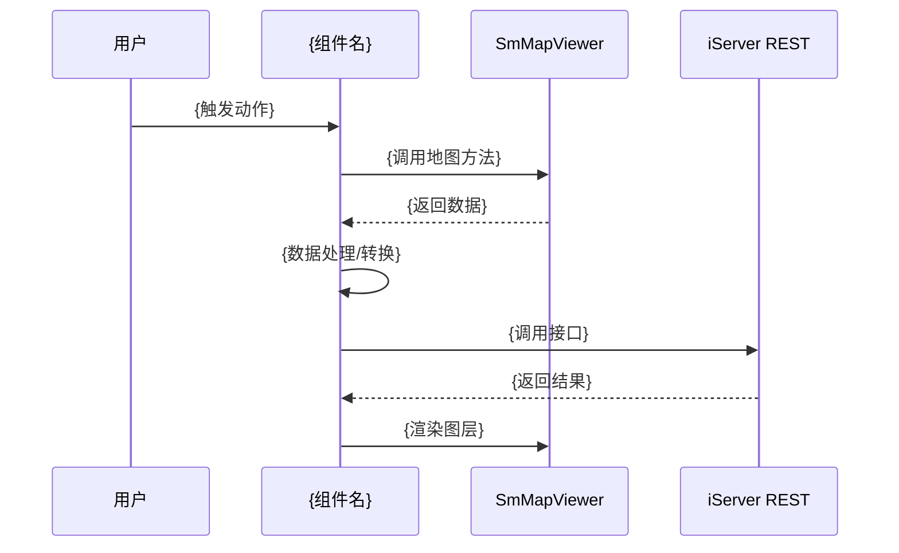

# {业务名称} 业务流程

## 1. 业务背景

一句话交代什么场景、解决什么问题。

## 2. 角色与触发

列出参与角色（用户、组件、外部服务）和触发条件。

## 3. 流程时序图

## 4. 关键数据转换

每一步"输入字段 → 变换 → 输出字段"，对应到 entities/ 页面。

| 步骤 | 输入（entity） | 处理逻辑 | 输出（entity） |
|------|--------------|---------|--------------|
| 1. {步骤名} | {输入 entity} | {处理逻辑} | {输出 entity} |
| 2. {步骤名} | {输入 entity} | {处理逻辑} | {输出 entity} |

## 5. 异常分支

列出常见错误码、对应的 entity 字段、页面上的提示。

| 错误场景 | 错误码/条件 | 提示信息 | 处理方式 |
|---------|-----------|---------|---------|
| {场景} | {错误码} | {提示} | {处理} |

## 6. 代码定位

按数据流向倒序，方便排查问题。

| 代码位置 | 职责 |
|---------|------|
| {组件路径}:{行号} | {职责描述} |
| {工具函数路径} | {职责描述} |

## 7. 关联页面

- 相关组件：`[[{组件页}]]`
- 相关实体：`[[{实体页}]]`
- 相关接口：`[[{接口页}]]`
