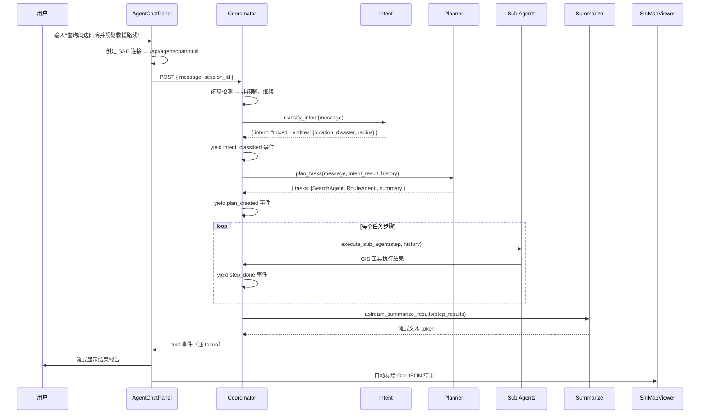

# Agent 应急分析流程

## 1. 业务背景

**核心创新模块**：通过自然语言交互替代传统 GIS 工具栏操作，实现"一句话完成 GIS 应急分析"。

用户输入自然语言（如"查询北京市朝阳区附近的医院并规划救援路线"），Coordinator 自动完成意图识别 → 任务规划 → 工具调用 → 结果汇总，生成结构化报告并标绘到地图。

## 2. 角色与触发

| 角色 | 职责 |
|------|------|
| 用户 | 在 AgentChatPanel 输入自然语言 |
| AgentChatPanel | 前端聊天面板，SSE 连接管理 |
| Coordinator | 核心调度器，驱动全流程 |
| Intent | 六类意图分类 + 实体抽取 |
| Planner | 任务拆解为子任务序列 |
| Sub Agents | SearchAgent / AnalysisAgent / RouteAgent / KnowledgeAgent |
| Summarize | 流式汇总结果生成报告 |

## 3. 流程时序图

## 4. 三层架构

### 4.1 语义理解层

| 步骤 | 输入 | 处理 | 输出 |
|------|------|------|------|
| 意图分类 | 用户自然语言 | DeepSeek LLM 推理 | 6 类意图 + 实体 |
| 实体抽取 | 用户输入 | NER 提取 | location/disaster/radius/dataset |

### 4.2 任务执行层

| 任务类型 | 可用工具 | 适用场景 |
|---------|---------|---------|
| Search | feature_search, spatial_query, fly_to_location, mock_nearby_resources | 地理要素检索 |
| Analysis | buffer_analysis, dual_buffer_analysis, overlay_analysis | 空间分析 |
| Route | shortest_path, service_area, online_route_planning, pareto_resource_optimize, aco_multi_vehicle_route | 路径规划 |
| Knowledge | rag_retrieval | 应急知识查询 |

### 4.3 协同调度层

| 策略 | 实现 |
|------|------|
| 双轨制调度 | async function 替代 LangGraph StateGraph |
| 退化 Polygon 兜底 | 自动检测并替换 inner Polygon |
| 灾害半径映射 | 地震 3000/8000、火灾 1000/3000、洪水 2000/5000 |
| RAG 知识增强 | FAISS 向量检索应急知识 |
| Pareto 资源优选 | 多目标优化求解最优解集 |

## 5. 关键数据转换

| 步骤 | 输入 | 处理 | 输出 |
|------|------|------|------|
| 用户输入 | "查询周边医院" | Coordinator 调度 | 意图 + 实体 |
| 工具调用 | feature_search(keyword="医院") | iServer SQL 查询 | GeoJSON FeatureCollection |
| 结果渲染 | GeoJSON | map.addSource + addLayer | 地图标绘 |
| 报告生成 | step_results | LLM 流式汇总 | 结构化文本报告 |

## 6. 异常分支

| 错误场景 | 处理 |
|---------|------|
| SSE 连接失败 | 降级到单 Agent 模式 |
| 意图分类失败 | LLM 重试（最多 3 次） |
| GIS 工具执行失败 | 跳过该步骤，继续后续步骤 |
| 知识库未初始化 | 跳过 RAG 检索，纯 LLM 回答 |

## 7. 代码位置

| 文件 | 路径 |
|------|------|
| API 入口 | `agent-backend/app/api/agent.py` |
| 协调器 | `agent-backend/app/agent/coordinator.py` |
| 子 Agent | `agent-backend/app/agent/sub_agents/agents.py` |
| 前端 SSE | `frontend/src/utils/agent/sse.js` |

## 8. 关联页面

- 前端：`[[pages/components/agent-chat-panel]]`
- 后端：`[[pages/components/agent-coordinator]]` `[[pages/components/agent-sub-agents]]`
- 概念：`[[pages/concepts/multi-agent]]`
- API：`[[pages/apis/agent-api]]`
