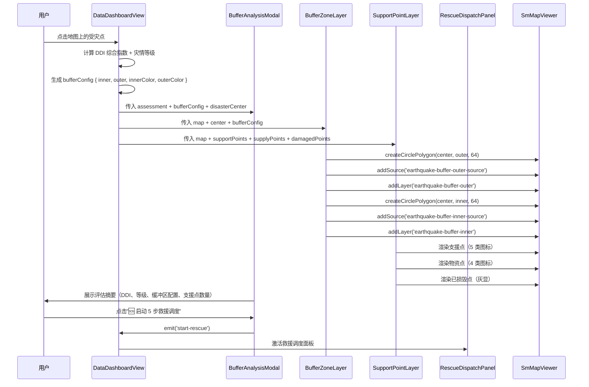

# 缓冲区分析业务流程

## 1. 业务背景

地震应急场景下，需要以受灾点为中心生成内/外双圈缓冲区：
- **内圈**（红色）：灾害影响范围，表示直接破坏区域
- **外圈**（橙色）：应急支援范围，表示可调动的救援力量覆盖区域

在缓冲区范围内叠加支援点（消防/医院/物资库/避难场所）和物资点，最终触发 5 步救援调度。

## 2. 角色与触发

| 角色 | 职责 |
|------|------|
| 用户 | 在地图上点击受灾点，触发缓冲区分析 |
| DataDashboardView | 页面容器，协调各子组件 |
| BufferZoneLayer | 渲染双圈缓冲区 Polygon |
| SupportPointLayer | 渲染支援点/物资点/已损毁点 |
| BufferAnalysisModal | 展示评估摘要 + 启动调度按钮 |
| RescueDispatchPanel | 5 步救援调度执行面板 |

## 3. 流程时序图

## 4. 关键数据转换

| 步骤 | 输入（entity） | 处理逻辑 | 输出（entity） |
|------|--------------|---------|--------------|
| 1. 定位受灾点 | 地图点击坐标 `[lng, lat]` | 提取坐标 + 计算 DDI 指数 | `assessment { ddi, level, bufferConfig }` |
| 2. 生成缓冲区 | `bufferConfig { inner, outer }` | `createCirclePolygon(center, radius, 64)` → GeoJSON Polygon | 外圈 Polygon + 内圈 Polygon |
| 3. 渲染缓冲区 | 外圈/内圈 Polygon | `map.addSource()` + `map.addLayer()` | 地图上的双圈填充图层 |
| 4. 叠加支援点 | `supportPoints[]` | `toFeature()` → GeoJSON FeatureCollection | 地图上的点标记图层 |
| 5. 启动调度 | 用户点击按钮 | 校验 4 类支援点齐全 → emit 事件 | RescueDispatchPanel 激活 |

## 5. 异常分支

| 错误场景 | 错误码/条件 | 提示信息 | 处理方式 |
|---------|-----------|---------|---------|
| 地图实例未就绪 | `map` 为 null | 静默失败，不渲染 | 等待地图加载完成后重试 |
| 缓冲区配置缺失 | `bufferConfig` 为 null | 弹窗不显示 | 检查上游 assessment 计算 |
| 支援点不齐全 | 缺少消防/医院/物资库/避难场所任一类型 | 按钮禁用 + 提示文案 | 等待数据加载或调整缓冲区半径 |
| 已损毁点存在 | `damagedPoints.length > 0` | 红色高亮显示 | 在调度中自动跳过已损毁点 |

## 6. 代码定位

| 代码位置 | 职责 |
|---------|------|
| `DataDashboardView.vue:top-layer` | 协调 BufferZoneLayer + SupportPointLayer + BufferAnalysisModal |
| `BufferZoneLayer.vue:render()` | 双圈缓冲区 Polygon 生成与渲染 |
| `SupportPointLayer.vue:toFeature()` | 支援点/物资点 GeoJSON 转换 |
| `BufferAnalysisModal.vue:canStartRescue` | 4 类支援点齐全校验 |
| `circlePolygon.js:createCirclePolygon()` | haversine 距离 + 64 边近似圆算法 |

## 7. 关联页面

- 相关组件：`[[pages/components/dashboard-buffer-analysis-modal]]` `[[pages/components/earthquake-buffer-zone-layer]]` `[[pages/components/earthquake-rescue-dispatch-panel]]`
- 相关页面：`[[pages/views/data-dashboard-view]]`
- 相关概念：`[[pages/concepts/buffer-analysis]]`
