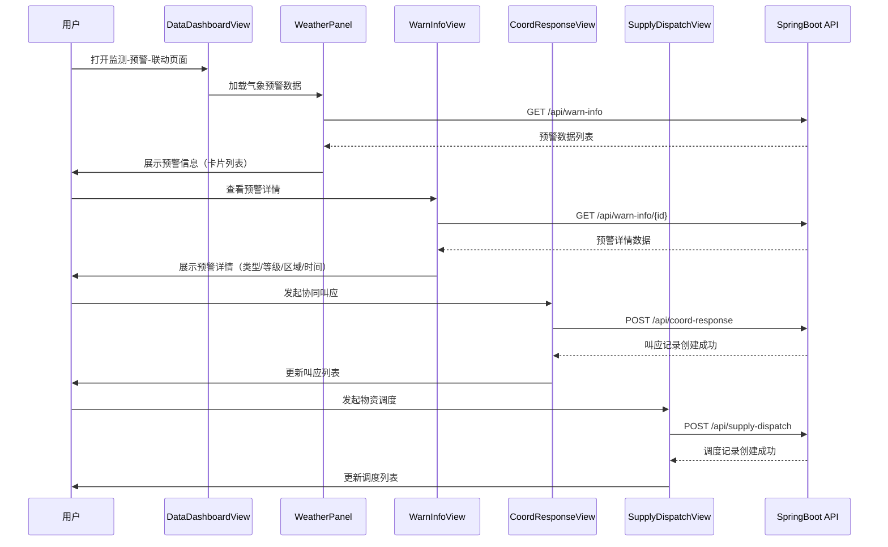

# 协同叫应流程

## 1. 业务背景

气象灾害预警触发后的区域联动处置流程：
- 气象预警信息生成 → 区域联动叫应 → 协同处置反馈 → 物资调度

## 2. 角色与触发

| 角色 | 职责 |
|------|------|
| 用户 | 在 DataDashboardView 查看预警信息 |
| WeatherPanel | 展示气象预警实时信息 |
| WarnInfoView | 气象灾害预警查询与展示 |
| CoordResponseView | 协同叫应处置记录 |
| SupplyDispatchView | 应急物资调度管理 |

## 3. 流程时序图

## 4. 关键数据转换

| 步骤 | 输入 | 处理 | 输出 |
|------|------|------|------|
| 预警生成 | 气象数据 | 灾害类型 + 预警等级校验 | WarnInfo 记录 |
| 叫应触发 | 预警 ID + 区域 | 创建叫应记录 | CoordResponse 记录 |
| 物资调度 | 物资类型 + 数量 + 目的地 | 创建调度记录 | SupplyDispatch 记录 |

## 5. 异常分支

| 错误场景 | 处理 |
|---------|------|
| API 请求失败 | 显示错误提示，可重试 |
| 数据校验失败 | 返回具体字段错误 |
| 网络超时 | 自动重试 1 次 |

## 6. 代码位置

| 文件 | 路径 |
|------|------|
| WarnInfoService | `backend/src/main/java/com/gis/emergency/service/WarnInfoService.java` |
| CoordResponseService | `backend/src/main/java/com/gis/emergency/service/CoordResponseService.java` |
| SupplyDispatchService | `backend/src/main/java/com/gis/emergency/service/SupplyDispatchService.java` |
| WeatherPanel | `frontend/src/components/dashboard/WeatherPanel.vue` |

## 7. 关联页面

- 页面：`[[pages/views/data-dashboard-view]]` `[[pages/views/warn-info-view]]` `[[pages/views/coord-response-view]]` `[[pages/views/supply-dispatch-view]]`
- 实体：`[[pages/entities/coord-response]]` `[[pages/entities/warn-info]]` `[[pages/entities/supply-dispatch]]`
