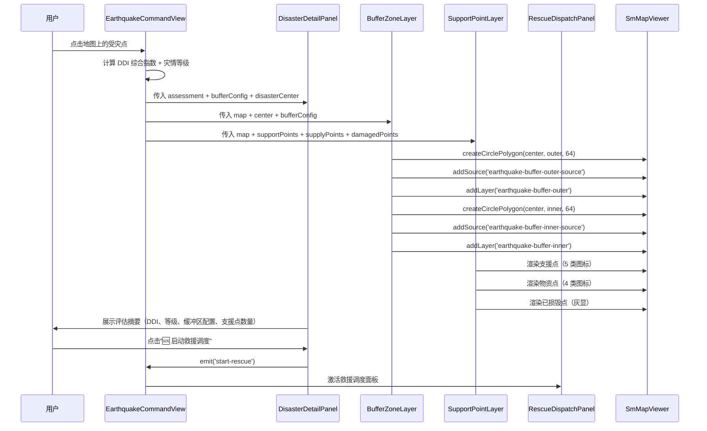

# 双缓冲区应急流程

## 1. 业务背景

地震、洪水、火灾应急场景下，以受灾点为中心生成内/外双圈缓冲区：

- **内圈**（红色）：灾害影响范围，表示直接破坏区域
- **外圈**（橙色）：应急支援范围，表示可调动的救援力量覆盖范围

在缓冲区范围内叠加支援点（消防/医院/物资库/避难场所）和物资点，最终触发救援调度。

## 2. 灾害类型-半径映射

| 灾害类型 | 内圈半径 | 外圈半径 |
|---------|---------|---------|
| 地震 | 3000m | 8000m |
| 火灾 | 1000m | 3000m |
| 洪水 | 2000m | 5000m |

LLM 漏传半径参数时自动兜底，确保应急分析准确。

## 3. 角色与触发

| 角色 | 职责 |
|------|------|
| 用户 | 在地图上点击受灾点，触发缓冲区分析 |
| EarthquakeCommandView | 页面容器，协调各子组件 |
| DisasterDetailPanel | 展示评估摘要（DDI、等级、缓冲区配置） |
| BufferZoneLayer | 渲染双圈缓冲区 Polygon |
| SupportPointLayer | 渲染支援点/物资点/已损毁点 |
| RescueDispatchPanel | 5 步救援调度执行面板 |

## 4. 流程时序图

## 5. 关键数据转换

| 步骤 | 输入 | 处理 | 输出 |
|------|------|------|------|
| 定位受灾点 | 地图点击坐标 [lng, lat] | 提取坐标 + 计算 DDI 指数 | assessment { ddi, level, bufferConfig } |
| 生成缓冲区 | bufferConfig { inner, outer } | createCirclePolygon(center, radius, 64) → GeoJSON Polygon | 外圈 Polygon + 内圈 Polygon |
| 渲染缓冲区 | 外圈/内圈 Polygon | map.addSource + map.addLayer | 地图上的双圈填充图层 |
| 叠加支援点 | supportPoints[] | toFeature → GeoJSON FeatureCollection | 地图上的点标记图层 |
| 启动调度 | 用户点击按钮 | 校验 4 类支援点齐全 → emit 事件 | RescueDispatchPanel 激活 |

## 6. 异常分支

| 错误场景 | 处理 |
|---------|------|
| 地图实例未就绪 | 静默失败，不渲染 |
| 缓冲区配置缺失 | 弹窗不显示 |
| 支援点不齐全 | 按钮禁用 + 提示文案 |
| 已损毁点存在 | 红色高亮显示 |

## 7. 代码位置

| 文件 | 路径 |
|------|------|
| BufferZoneLayer | `frontend/src/components/earthquake/BufferZoneLayer.vue` |
| SupportPointLayer | `frontend/src/components/earthquake/SupportPointLayer.vue` |
| RescueDispatchPanel | `frontend/src/components/earthquake/RescueDispatchPanel.vue` |
| DisasterDetailPanel | `frontend/src/components/dashboard/DisasterDetailPanel.vue` |

## 8. 关联页面

- 页面：`[[pages/views/earthquake-command-view]]`
- 组件：BufferZoneLayer, SupportPointLayer, RescueDispatchPanel, DisasterDetailPanel
- 概念：`[[pages/concepts/buffer-analysis]]`
