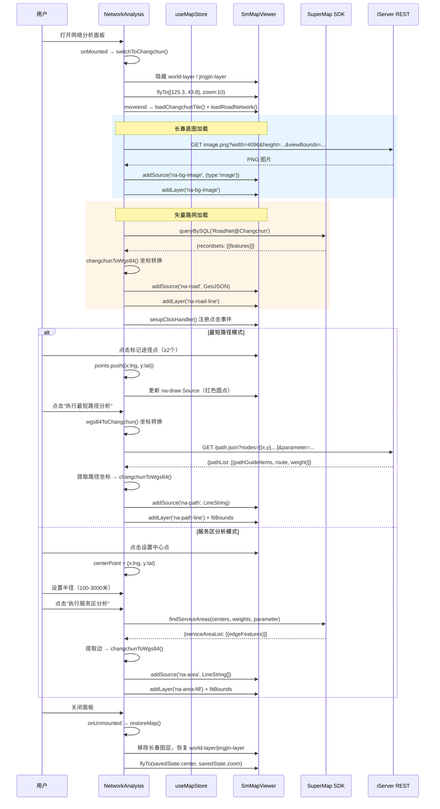

# 网络分析业务流程

## 1. 业务背景

基于长春市路网数据，提供两种网络分析能力：
- **最短路径分析**：用户标记 ≥2 个途径点，计算经过道路网络的最短路径
- **服务区分析**：用户设置中心点和半径，计算道路网络覆盖范围

分析使用 SuperMap iServer 的 transportationanalyst 服务，路网数据为 `RoadNet@Changchun`。

## 2. 角色与触发

| 角色 | 职责 |
|------|------|
| 用户 | 选择分析模式，标记路径点/中心点，设置半径 |
| NetworkAnalysis | 主组件：管理分析状态、调用 SDK、渲染结果 |
| SmMapViewer | 地图实例，支持点击标记和图层操作 |
| useMapStore | Pinia store，共享地图实例和图层管理 |
| SuperMap SDK | `NetworkAnalystService` / `QueryService` |

## 3. 流程时序图

## 4. 关键数据转换

| 步骤 | 输入（entity） | 处理逻辑 | 输出（entity） |
|------|--------------|---------|--------------|
| 1. 地图切换 | 当前地图视图 | 隐藏京津冀图层 → 飞往长春 → 加载底图 | 长春市区图可见 |
| 2. 路网加载 | `recordsets[].features` | `changchunToWgs84()` 坐标转换 | GeoJSON LineString 数组 |
| 3. 标记路径点 | 地图点击 `[lng, lat]` | 直接存入 `points[]` | `{x: lng, y: lat}` |
| 4. 坐标转长春平面 | WGS84 坐标 | `wgs84ToChangchun(lng, lat)` | 平面坐标 `{x, y}` |
| 5. 路径分析请求 | 平面坐标点数组 | 拼接 URL 参数 `nodes=[{x,y}]` | GET 请求 URL |
| 6. 路径结果解析 | `{pathList: [{pathGuideItems, route}]}` | 提取坐标 → `changchunToWgs84()` | WGS84 LineString 坐标 |
| 7. 服务区结果解析 | `{serviceAreaList: [{edgeFeatures}]}` | 提取边 → `changchunToWgs84()` | WGS84 LineString 数组 |

## 5. 异常分支

| 错误场景 | 错误码/条件 | 提示信息 | 处理方式 |
|---------|-----------|---------|---------|
| 长春底图加载失败 | iServer 返回错误 | 控制台警告 | 路网仍可加载，分析功能正常 |
| 路网加载失败 | `queryBySQL` 异常 | `console.warn('[路网] 加载失败')` | 分析功能不可用，提示用户 |
| 路径点不足 | `points.length < 2` | 按钮禁用 | 等待用户添加更多点 |
| 未设置中心点 | `centerPoint` 为 null | 按钮禁用 | 等待用户点击地图 |
| 路径分析失败 | API 返回错误 | `resultInfo = '请求失败: ...'` | 显示错误信息，不清空标记 |
| 服务区分析失败 | SDK 回调 `processFailed` | `resultInfo = '请求失败: ...'` | 显示错误信息 |
| 未找到路径 | `data.pathList` 为空 | `resultInfo = '未找到路径'` | 提示用户调整路径点 |

## 6. 代码定位

| 代码位置 | 职责 |
|---------|------|
| `NetworkAnalysis.vue:switchToChangchun()` | 切换长春视图：隐藏京津冀 → 飞往长春 → 加载底图路网 |
| `NetworkAnalysis.vue:loadChangchunTile()` | 加载长春 tileImage 底图（PNG + viewBounds） |
| `NetworkAnalysis.vue:loadRoadNetwork()` | 加载 RoadNet 矢量路网（queryBySQL + 坐标转换） |
| `NetworkAnalysis.vue:findPathAsync()` | 最短路径 GET 请求封装 |
| `NetworkAnalysis.vue:findServiceAreasAsync()` | 服务区分析 SDK Promise 封装 |
| `NetworkAnalysis.vue:displayPathResult()` | 路径结果解析 + 渲染 |
| `NetworkAnalysis.vue:displayAreaResult()` | 服务区结果解析 + 渲染 |
| `map.js:changchunToWgs84()` / `wgs84ToChangchun()` | 长春平面坐标 ↔ WGS84 坐标转换 |

## 7. 关联页面

- 相关组件：`[[pages/components/network-analysis]]`
- 相关页面：`[[pages/views/home-view]]`
- 相关 API：`[[pages/apis/iserver-network-analyst]]`（iServer transportationanalyst REST API）
