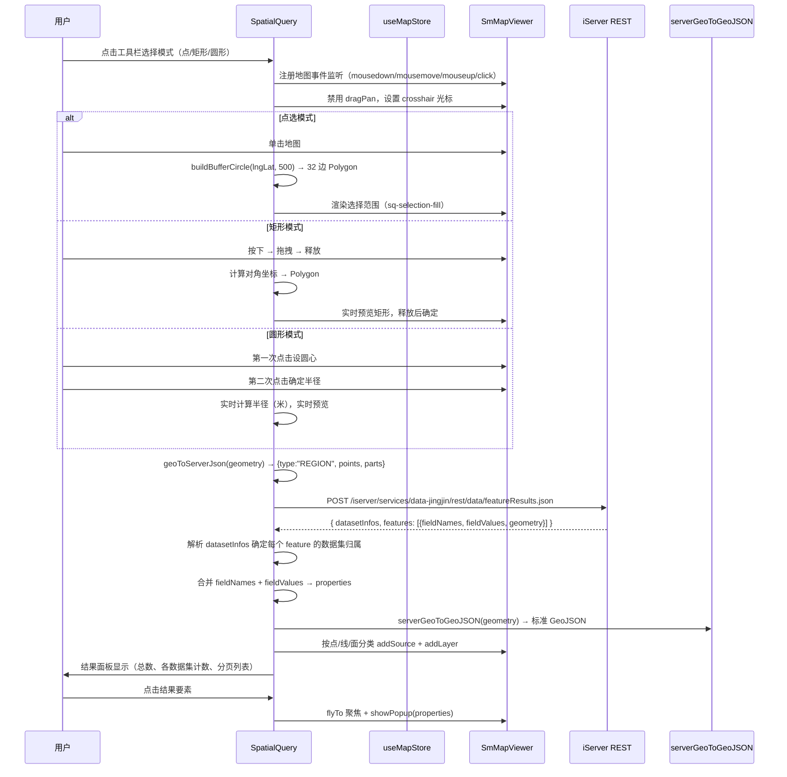

# 空间查询业务流程

## 1. 业务背景

用户绘制点/矩形/圆形范围，查询京津冀地区 9 个数据集（县级市、乡镇、道路、铁路、河流、湖泊、土地利用、地貌、海岸线）的空间要素，结果按点/线/面分类渲染，支持点击要素查看详情。

## 2. 角色与触发

| 角色 | 职责 |
|------|------|
| 用户 | 选择绘制模式，在地图上绘制范围 |
| SpatialQuery | 主组件：管理绘制状态、调用查询、渲染结果 |
| SmMapViewer | 地图实例，接收绘制事件和图层操作 |
| useMapStore | Pinia store，共享地图实例 |

## 3. 流程时序图

## 4. 关键数据转换

| 步骤 | 输入（entity） | 处理逻辑 | 输出（entity） |
|------|--------------|---------|--------------|
| 1. 绘制范围 | 地图点击/拖拽坐标 | `buildBufferCircle` / 矩形坐标计算 | GeoJSON Polygon |
| 2. 坐标转 iServer | GeoJSON Polygon `{type:"Polygon", coordinates}` | `geoToServerJson()` | iServer REGION `{type:"REGION", points:[{x,y}], parts:[n]}` |
| 3. 构建请求体 | REGION + 9 个数据集名 | 拼接 datasetNames + spatialQueryMode | POST body `{getFeatureMode:"SPATIAL", datasetNames, geometry, spatialQueryMode:"INTERSECT"}` |
| 4. 解析响应 | `{datasetInfos, features}` | 按 featureRange 确定数据集归属 | `{dataset, datasetName, geometry, properties, displayName}[]` |
| 5. 坐标标准化 | iServer 几何 `{type:"POINT/LINE/REGION", points/parts}` | `serverGeoToGeoJSON()` | 标准 GeoJSON `{type:"Point/LineString/Polygon"}` |
| 6. 分类渲染 | GeoJSON features | 按 geometry.type 点/线/面分 3 个 Source | 地图上的 3 个结果图层 |

## 5. 异常分支

| 错误场景 | 错误码/条件 | 提示信息 | 处理方式 |
|---------|-----------|---------|---------|
| iServer 请求失败 | `res.ok === false` | 显示错误信息（截取前 200 字符） | 展示错误面板，不清空已有结果 |
| 查询结果为空 | `allFeatures.length === 0` | 显示"未查询到要素" | 保留结果面板，显示空提示 |
| 地图实例未就绪 | `store.mapInstance` 为 null | 静默退出 | 等待地图加载 |
| 事件未清理 | 组件卸载时 | — | `onUnmounted` → `clearAll()` 清除图层和事件 |

## 6. 代码定位

| 代码位置 | 职责 |
|---------|------|
| `SpatialQuery.vue:toggleMode()` | 模式切换：激活/停用绘制 |
| `SpatialQuery.vue:activateDrawMode()` | 注册地图事件 + 禁用平移 |
| `SpatialQuery.vue:buildBufferCircle()` | 32 边近似圆生成（haversine 距离） |
| `SpatialQuery.vue:geoToServerJson()` | GeoJSON → iServer Server JSON 格式转换 |
| `SpatialQuery.vue:doQuery()` | 执行 fetch 请求 + 结果解析 |
| `SpatialQuery.vue:displayResults()` | 按点/线/面分类渲染到地图 |
| `map.js:serverGeoToGeoJSON()` | iServer 几何 → 标准 GeoJSON |

## 7. 关联页面

- 相关组件：`[[pages/components/spatial-query]]` `[[pages/components/feature-search]]`
- 相关页面：`[[pages/views/home-view]]`
- 相关 API：`[[pages/apis/iserver-feature-results]]`（iServer featureResults REST API）
