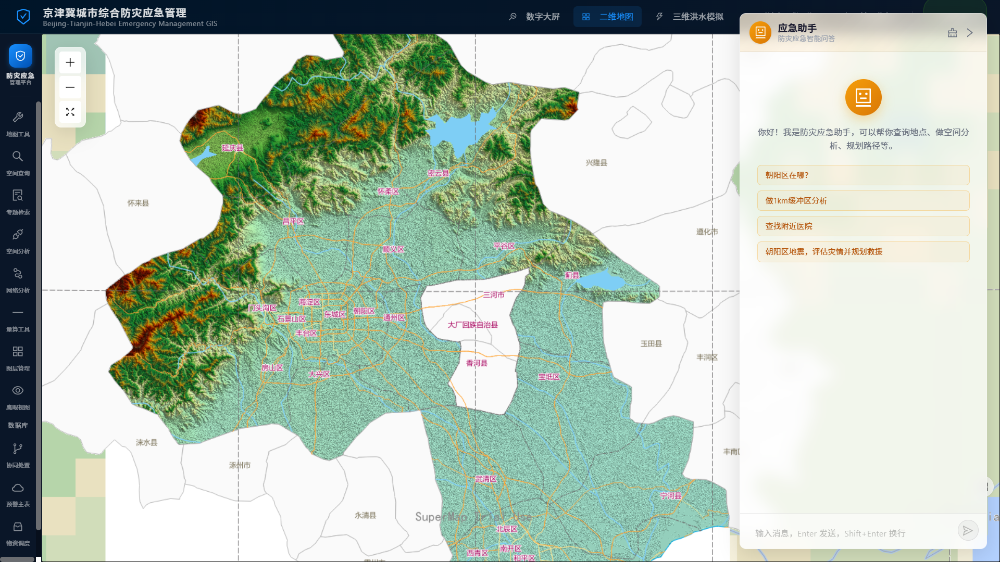
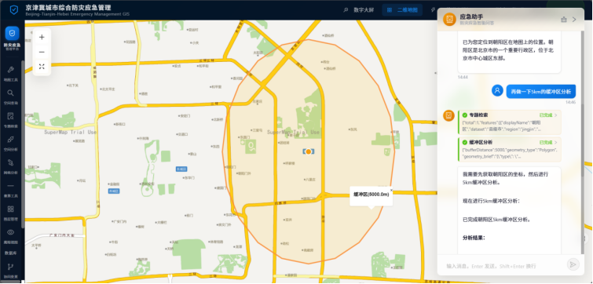
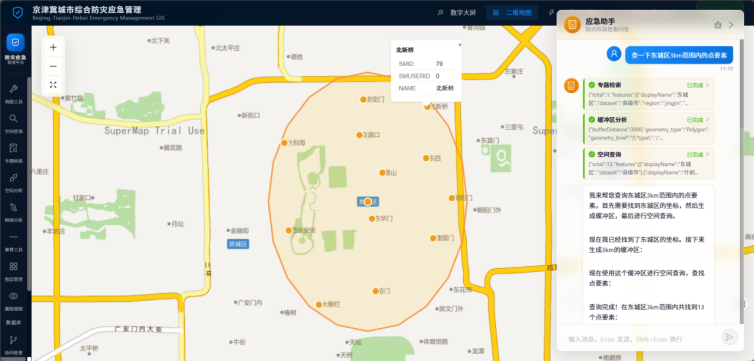
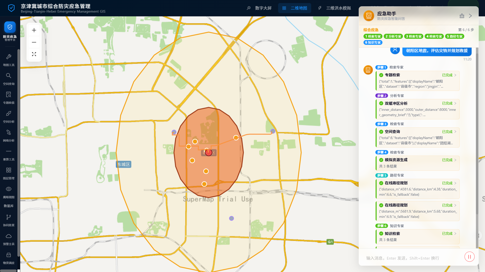
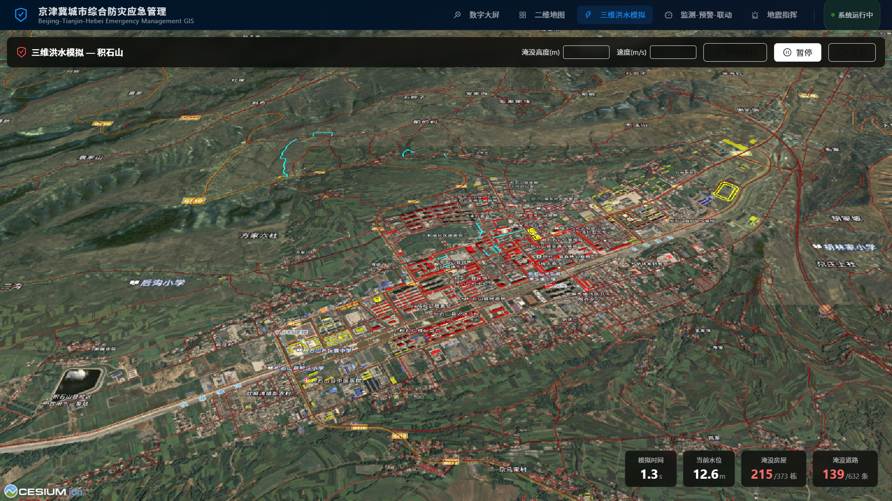
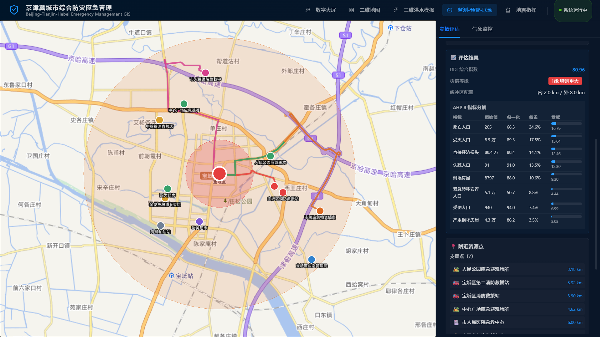
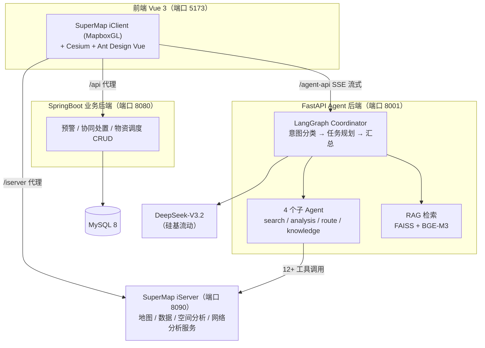

# 京津冀城市综合防灾应急管理系统

<div align="center">


**基于多智能体（LangGraph）+ RAG 的 GIS 应急管理平台**

集成多源空间数据可视化、空间分析、网络分析、三维洪水模拟与 AI 智能问答

</div>

> 课程：GIS 工程应用实践 ｜ 数据处理：SuperMap iDesktopX 2025 ｜ 服务发布：SuperMap iServer 11i

<!-- 截图建议：系统最具代表性的一张图（推荐：二维地图主页 + AI 助手对话面板展开），保存为 docs/images/overview.png -->



---

## 项目亮点

- **多智能体 GIS 助手**：LangGraph Coordinator 调度 4 个子 Agent（检索 / 分析 / 路径 / 知识），意图分类 → 任务规划 → 工具调用 → 流式汇总，支持单一意图直连（低延迟）与混合意图编排两种模式
- **12+ GIS / 算法工具**：要素检索、空间查询、缓冲区、叠置分析、最短路径、服务区分析，以及 Pareto 多目标优化、ACO 蚁群路径分配
- **RAG 应急知识库**：FAISS 向量检索 + BGE-M3 中文 Embedding，5 篇应急预案文档秒级召回
- **完整 GIS 分析链路**：基于 SuperMap iServer REST 服务实现空间查询、缓冲区分析、叠置分析、网络分析全流程
- **二三维一体化**：MapboxGL 二维地图 + Cesium 三维洪水淹没模拟
- **灾情评估算法**：AHP 层次分析法多指标评估（气象灾情 / 地震 AHP-DDI 8 指标），灾害等级 4 级划分驱动救援调度
- **工程化实践**：OpenSpec 变更文档（proposal → design → spec → tasks → checklist）、Vitest 单元测试、三服务架构（Vue3 / SpringBoot / FastAPI）

---

## 功能总览

系统按顶部导航分为 **5 大模块**，另有 3 个数据库 CRUD 管理页。

### AI 应急助手（对话式 GIS 分析）

通过自然语言对话直接驱动 GIS 工具，分析结果（GeoJSON）自动叠加渲染到地图。

| 对话式缓冲区分析 | 点要素范围查询 |
|:---:|:---:|
|  |  |

**综合救援调度** —— 多 Agent 协同（检索 / 分析 / 路径 / 知识）完成的一次完整任务：



### 其他模块

| 三维洪水模拟 | 监测-预警-联动 |
|:---:|:---:|
|  |  |

<details>
<summary><b>各模块功能明细（点击展开）</b></summary>

### 数字大屏 `/new-big-screen`

**气象灾害监测大屏**（NewBigScreenView），面向值班人员实时监控天气态势。

- **KPI 指标卡**：大风强度（级）、降雨深度（mm）、温度（℃）、湿度（%），超阈值自动高亮警告
- **气象趋势图**：过去 24h 风力/降雨/温度折线图
- **系统状态**：实时时钟、运行状态指示灯

### 二维地图 `/`

**系统核心主页面**（HomeView + SmMapViewer），集成 GIS 操作、数据管理与 AI 问答，左侧 NavSidebar 提供功能入口。

#### 基础 GIS 操作（左侧工具栏，地图内嵌组件）

| 功能 | 组件 | 说明 |
|------|------|------|
| 地图工具 | MapToolbar | 全幅显示、放大、缩小、平移 |
| 鹰眼视图 | MapOverview | 小地图概览，拖拽快速定位 |
| 量算工具 | MapMeasure | 距离量算、面积量算 |
| 图层管理 | LayerManager | 控制各图层显隐与透明度 |
| 空间查询 | SpatialQuery | 绘制点/矩形/圆查询 POI，结果标绘 + 属性弹窗 |
| 专题检索 | FeatureSearch | 关键字搜索地物、行政级别（省/县/乡镇）分级检索 |
| 缓冲区与叠置分析 | SpatialAnalysis | 缓冲区辐射范围分析、土地利用叠置分析 |
| 网络分析 | NetworkAnalysis | 最短路径分析、服务区分析（基于长春路网数据） |

#### 数据库 CRUD 管理（NavSidebar → "数据库"分组 → 独立路由页面）

| 功能 | 路由 | 页面 | 表 |
|------|------|------|----|
| 预警主表 | `/warn-info` | WarnInfoView | `tb_warn_info` — 气象灾害预警录入/编辑/查询/删除 |
| 协同处置 | `/coord-response` | CoordResponseView | `tb_coord_response` — 协同叫应记录管理 |
| 物资调度 | `/supply-dispatch` | SupplyDispatchView | `tb_supply_dispatch` — 应急物资调度管理 |

#### AI 应急助手（AgentChatPanel 浮动面板）

- **多 Agent 协同架构**：Coordinator 调度器 → 意图分类 → 任务规划 → 4 个子 Agent（search / analysis / route / knowledge）顺序执行 → 流式汇总输出
- **12+ 工具**：feature_search / spatial_query / buffer_analysis / dual_buffer_analysis / overlay_analysis / shortest_path / service_area / fly_to_location / online_route_planning / mock_nearby_resources + Pareto 多目标优化 + ACO 蚁群路径分配
- **RAG 知识库**：5 篇应急预案文档（地震/火灾/洪水/医疗救援/综合预案），FAISS 向量检索
- **双模式**：单一意图 → 单 Agent（低延迟）；混合意图 → Coordinator 多 Agent 编排
- **前端渲染**：工具返回的 GeoJSON 自动叠加到地图，受灾点红色标记，支援点琥珀色标记

### 三维洪水模拟 `/flood-simulation`

**Cesium 3D 场景**（FloodSimulationView），演示积石山区域洪水淹没过程。

- 淹没参数调节：高度（m）/ 速度（m/s）
- 控制：开始模拟 / 暂停继续 / 重置
- 实时水位动态上升效果

### 监测-预警-联动 `/data-dashboard`

半屏面板布局：左侧地图 + 右侧页签切换。

- **分级地图**（DashboardMap）：县级行政区灾害标记着色，点击选中目标县域
- **气象监控**（WeatherPanel）：实时气象数据（风力/降雨/温度/湿度）
- **AHP 灾情评估**（DisasterDetailPanel）：选定县域的多指标层次分析评估
- **一键救援**：灾情评估面板触发 → 缓冲区分析弹窗（BufferAnalysisModal）→ 5 步救援调度弹窗（RoutePlanningModal）

### 地震指挥 `/earthquake-command`

**地震应急指挥专页**（EarthquakeCommandView），面向地震场景的一站式指挥。

- **震情概览**：区域、震级、时间、位置、应急等级（I~IV 级），盲区预警/未应答/物资缺口实时滚动
- **组织层级树**：国家 → 京津冀联合指挥部 → 地市 → 区县 → 乡镇，折叠/展开
- **AHP-DDI 灾情评估**：8 指标（地震强度/震源深度/人口密度/建筑脆弱性/道路通达性/医疗容量/物资储备/次生灾害风险），层次分析法计算 → 4 级划分
- **双缓冲区分析**：受灾圈（小半径）+ 支援圈（大半径），按灾害等级动态调整半径
- **救援调度**：5 步流程（建队伍→医疗→物资→交通→避难），4 路彩色路径渲染
- **Pareto 多目标优化 + ACO 蚁群路径分配**：在距离与容量之间找 Pareto 最优解，ACO 多车路径分配

</details>

---

## 系统架构



---

## 技术栈

| 层 | 技术 |
|----|------|
| 前端 | Vue 3.5 + Vite 8 + Ant Design Vue 4 + MapboxGL 1.13 + `@supermap/iclient-mapboxgl` 11.1 + Cesium + Pinia 3 + Vue Router 4 + Axios 1.7 + markdown-it 14 |
| 后端（业务） | SpringBoot 3.4 + MyBatis 3 + MySQL 8（Java 17） |
| 后端（Agent） | FastAPI + LangGraph + LangChain + DeepSeek-V3.2（硅基流动）+ FAISS |
| GIS 服务 | SuperMap iServer 11i（地图/数据/空间分析/网络分析服务） |
| 数据 | Jingjin.udbx / World.udbx / Changchun.udbx（iServer 自带样本数据） |

---

## 快速开始

### 环境要求

| 软件 | 版本 |
|------|------|
| JDK | 17+ |
| Maven | 3.8+ |
| Node.js | 18+ |
| Python | 3.10+ |
| MySQL | 8.0+ |
| SuperMap iServer | 11i (11.3.0) |

### 启动步骤（5 个服务，按序执行）

```bash
# 1) SuperMap iServer（8090，GIS 数据/分析服务）
#    安装后进入 bin/ 运行 startup.bat，确认样本服务已发布

# 2) MySQL（3306）—— 后端首次启动自动建库建表，无需手动执行 SQL

# 3) SpringBoot 业务后端（8080）
cd backend
mvn spring-boot:run

# 4) FastAPI Agent 后端（8001）
cd agent-backend
python -m venv venv && venv\Scripts\activate   # Windows
pip install -r requirements.txt
cp .env.example .env                            # 填入硅基流动 API Key
python -m app.main

# 5) Vue 前端（5173）
cd frontend
npm install
npm run dev
```

浏览器访问 <http://localhost:5173>。各服务健康检查：`localhost:8080/api/health`、`localhost:8001/api/health`。

> 若不使用 AI 问答，可跳过第 4 步，其余模块（地图、CRUD、空间分析）仍可正常使用。

<details>
<summary><b>详细部署指南（iServer 服务确认 / MySQL / 各后端配置 / 启动顺序 / 常见问题，点击展开）</b></summary>

### SuperMap iServer 配置（端口 8090）

iServer 提供 GIS 数据服务、地图服务、空间分析、网络分析能力，是前端地图和 Agent 工具的数据源。

1. **安装并启动 iServer**
   - 安装路径示例：`D:\SuperMap\SuperMapiServer11i\`
   - 启动：进入 `bin/` 目录运行 `startup.bat`，浏览器访问 `http://localhost:8090/iserver`
   - 首次启动需设置管理员账号
2. **确认样本数据存在**（iServer 11i 自带，位于 `samples\data\`）

   | 数据文件 | 路径 | 用途 |
   |---------|------|------|
   | 京津冀数据 | `City\Jingjin.udbx` | 基础地图、空间查询、缓冲区分析 |
   | 世界底图 | `World\World.udbx` | 底图 |
   | 长春路网 | `NetworkAnalyst\Changchun.udbx` | 网络分析（最短路径/服务区） |

3. **发布/确认服务**：iServer 默认在 `webapps\iserver\WEB-INF\iserver-services-samples.xml` 中预配置了以下服务，首次启动后通常已自动发布，请在 iServer 管理页面「服务」列表中确认：

   | 服务名 | 类型 | 用途 |
   |--------|------|------|
   | `map-jingjin` | 地图服务 | 京津冀地图展示 |
   | `data-jingjin` | 数据服务 | 要素查询（POI、行政区域等） |
   | `spatialanalyst-sample` | 空间分析服务 | 缓冲区分析、叠置分析 |
   | `transportationanalyst-sample` | 交通网络分析服务 | 最短路径、服务区分析 |

   若未自动发布，可在管理页面「服务 → 创建服务」中基于上述数据源手动发布。

4. **验证**：浏览器访问 `http://localhost:8090/iserver/services`，应能看到上述服务列表。

### MySQL 数据库配置（端口 3306）

1. **安装并启动 MySQL 8**，确保 root 账号可登录：

   ```bash
   mysql -u root -p
   ```

2. **修改后端数据库账号密码**：打开 `backend/src/main/resources/application.yml`，修改第 10–12 行：

   ```yaml
   spring:
     datasource:
       url: jdbc:mysql://localhost:3306/emergency_db?createDatabaseIfNotExist=true&useUnicode=true&characterEncoding=utf8&useSSL=false&serverTimezone=Asia/Shanghai&allowPublicKeyRetrieval=true
       username: root                  # ← 改为你的 MySQL 用户名
       password: your-mysql-password   # ← 改为你的 MySQL 密码
       driver-class-name: com.mysql.cj.jdbc.Driver
   ```

   - `createDatabaseIfNotExist=true`：首次启动自动创建 `emergency_db`，无需手动建库
   - `serverTimezone=Asia/Shanghai`：时区配置，必须保留

3. **执行 SQL（建表 + 种子数据）**

   **方式 A（推荐，自动执行）**：保持 `application.yml` 中以下配置不变：

   ```yaml
   spring:
     sql:
       init:
         mode: always                              # 每次启动都执行
         schema-locations: classpath:schema.sql    # 建表（IF NOT EXISTS，幂等）
         data-locations: classpath:data.sql        # 种子数据（INSERT IGNORE，幂等）
         continue-on-error: false
   ```

   启动 SpringBoot 后端时，`schema.sql`（建 3 张表）和 `data.sql`（插入 18 条种子数据）会自动执行。

   **方式 B（手动执行）**：在 MySQL 客户端中执行：

   ```bash
   mysql -u root -p
   CREATE DATABASE IF NOT EXISTS emergency_db DEFAULT CHARACTER SET utf8mb4;
   USE emergency_db;
   SOURCE backend/src/main/resources/schema.sql;
   SOURCE backend/src/main/resources/data.sql;
   EXIT;
   ```

   > 若已通过方式 A 自动建表，不要再手动执行（无害但冗余）。

4. **数据表**

   | 表名 | 说明 | 主键 |
   |------|------|------|
   | `tb_warn_info` | 气象灾害预警主表 | `warn_id` |
   | `tb_coord_response` | 协同叫应处置表 | `response_id` |
   | `tb_supply_dispatch` | 应急物资调度总表 | `dispatch_id` |

### SpringBoot 业务后端配置（端口 8080）

1. **检查 iServer 配置**：`application.yml` 第 33–41 行已配置 iServer 服务地址，若你的 iServer 不在 `localhost:8090`，请修改：

   ```yaml
   iserver:
     base-url: http://localhost:8090
     data-service: data-jingjin
     datasource: Jingjin
     map-service: map-jingjin
     map-name: 京津地区地图
     spatial-service: spatialanalyst-sample
     transport-service: transportationanalyst-sample
   ```

2. **构建并启动**

   ```bash
   cd backend
   mvn clean package -DskipTests
   java -jar target/emergency-backend-0.0.1-SNAPSHOT.jar
   ```

   或在 IDE 中直接运行 `EmergencyApplication.java`。

3. **验证**：浏览器访问 `http://localhost:8080/api/health`，应返回：

   ```json
   { "code": 200, "message": "success", "data": "京津冀城市综合防灾应急管理系统后端运行正常" }
   ```

### FastAPI Agent 后端配置（端口 8001）

Agent 后端依赖**大模型 API Key** 才能运行 AI 问答功能。

1. **创建虚拟环境并安装依赖**

   ```bash
   cd agent-backend
   python -m venv venv
   # Windows
   venv\Scripts\activate
   # macOS/Linux
   source venv/bin/activate

   pip install -r requirements.txt
   ```

2. **配置 API Key（必须）**：复制环境变量模板 `cp .env.example .env`，编辑 `agent-backend/.env`：

   ```dotenv
   # LLM API 配置（硅基流动 SiliconFlow）
   # 注册地址：https://siliconflow.cn/  注册后在「API 密钥」页面创建 Key
   # 注意：变量名虽为 DEEPSEEK_API_KEY，实际填入的是硅基流动的 API Key
   DEEPSEEK_API_KEY=sk-your-siliconflow-api-key-here    # ← 改为你的真实 Key
   DEEPSEEK_BASE_URL=https://api.siliconflow.cn/v1
   DEEPSEEK_MODEL=deepseek-ai/DeepSeek-V3.2

   # iServer 配置（默认本机，无需修改）
   ISERVER_URL=http://localhost:8090

   # 后端配置
   HOST=0.0.0.0
   PORT=8001

   # RAG 配置（与 LLM 共用 API Key，留空则自动回退到 DEEPSEEK_API_KEY）
   EMBEDDING_BASE_URL=https://api.siliconflow.cn/v1
   EMBEDDING_MODEL=BAAI/bge-m3
   ```

   > Embedding 模型 `BAAI/bge-m3` 与 LLM 共用同一 Key，无需额外申请。

3. **启动**

   ```bash
   python -m app.main
   # 或热重载
   uvicorn app.main:app --host 0.0.0.0 --port 8001 --reload
   ```

4. **验证**：浏览器访问 `http://localhost:8001/api/health`，应返回：

   ```json
   { "status": "ok", "service": "gis-agent-backend" }
   ```

   启动日志中应看到 `RAG 知识库就绪：5 个文档已索引`（首次启动会自动构建 FAISS 向量库）。

### Vue 前端配置（端口 5173）

1. **安装依赖**：`cd frontend && npm install`
2. **确认 Vite proxy**：`vite.config.js` 已配置三组代理，默认无需修改：

   | 前缀 | 转发到 | 用途 |
   |------|--------|------|
   | `/iserver` | `http://localhost:8090` | iServer GIS 服务 |
   | `/api` | `http://localhost:8080` | SpringBoot 业务后端（CRUD 接口） |
   | `/agent-api` | `http://localhost:8001`（重写为 `/api`） | FastAPI Agent 后端（AI 问答接口） |

3. **启动**：`npm run dev`，浏览器访问 `http://localhost:5173`
4. **前端路由一览**

   | 导航分组 | 路由路径 | 页面 | 说明 |
   |----------|----------|------|------|
   | **数字大屏** | `/new-big-screen` | NewBigScreenView | 气象灾害监测大屏（KPI + 趋势图） |
   | **二维地图** | `/` | HomeView | 核心地图页（GIS 操作 + NavSidebar + AI 助手） |
   | | `/warn-info` | WarnInfoView | 预警主表 CRUD（NavSidebar → 数据库） |
   | | `/coord-response` | CoordResponseView | 协同处置 CRUD（NavSidebar → 数据库） |
   | | `/supply-dispatch` | SupplyDispatchView | 物资调度 CRUD（NavSidebar → 数据库） |
   | **三维洪水模拟** | `/flood-simulation` | FloodSimulationView | Cesium 3D 淹没模拟 |
   | **监测-预警-联动** | `/data-dashboard` | DataDashboardView | 综合监测评估（地图 + 灾情 + 气象） |
   | **地震指挥** | `/earthquake-command` | EarthquakeCommandView | 地震应急指挥专页 |

### 启动顺序速查

| 顺序 | 服务 | 端口 | 启动命令 | 启动条件 |
|------|------|------|---------|---------|
| 1 | SuperMap iServer | 8090 | `bin/startup.bat` | 已安装并发布样本服务 |
| 2 | MySQL | 3306 | 系统服务 | 已创建 root 账号或修改 `application.yml` |
| 3 | SpringBoot 后端 | 8080 | `mvn spring-boot:run` | iServer + MySQL 已启动 |
| 4 | FastAPI Agent 后端 | 8001 | `python -m app.main` | iServer 已启动 + `.env` 已配置 Key |
| 5 | Vue 前端 | 5173 | `npm run dev` | 上述后端均已启动 |

### 常见问题

**Q1：前端打开后地图空白？**
- 检查 iServer 是否启动：访问 `http://localhost:8090/iserver`
- 检查浏览器控制台是否有 `/iserver` 请求 404，确认服务名与 `application.yml` 一致

**Q2：后端启动报数据库连接失败？**
- 确认 MySQL 服务已启动
- 确认 `application.yml` 中 `username` / `password` 与本机 MySQL 一致
- 确认 URL 中 `createDatabaseIfNotExist=true` 参数存在（首次启动需自动建库）

**Q3：数据表未自动创建？**
- 检查 `application.yml` 中 `spring.sql.init.mode` 是否为 `always`
- 检查 `schema.sql` / `data.sql` 是否在 `src/main/resources/` 下
- 查看启动日志是否有 SQL 执行错误

**Q4：Agent 聊天无响应或报 401？**
- 确认 `agent-backend/.env` 中 `DEEPSEEK_API_KEY` 已填写真实 Key
- 确认 Key 余额充足（硅基流动账户）
- 确认 `DEEPSEEK_BASE_URL` 为 `https://api.siliconflow.cn/v1`（非 DeepSeek 官方地址）

**Q5：RAG 知识库初始化失败？**
- 首次启动会调用 Embedding API 构建向量库，需联网且 API Key 有效
- 失败为非致命错误，Agent 仍可运行（仅失去知识库检索能力）
- 重新启动时会自动重试

**Q6：网络分析模块无结果？**
- 确认 `transportationanalyst-sample` 服务已在 iServer 发布
- 确认长春路网数据 `Changchun.udbx` 存在
- 网络分析使用长春市数据，起终点需在长春市范围内

**Q7：端口被占用？**
- 8080 / 8001 / 5173 / 8090 任一被占用都会导致启动失败
- 使用 `netstat -ano | findstr <端口>` 查看占用进程
- 修改对应配置文件中的端口号（注意同步更新 `vite.config.js` 的 proxy target）

</details>

---

## 目录结构

<details>
<summary><b>查看完整目录结构（点击展开）</b></summary>

```
GIS-Practice/
├── frontend/                  # Vue3 前端
│   ├── src/
│   │   ├── components/
│   │   │   ├── dashboard/        # 数据大屏组件（DashboardMap, WeatherPanel, DisasterDetailPanel, BufferAnalysisModal, RoutePlanningModal）
│   │   │   ├── earthquake/       # 地震应急组件（BufferZoneLayer, SupportPointLayer, RescueDispatchPanel）
│   │   │   ├── agent/            # Agent 聊天组件（ChatMessage, ToolCallCard）
│   │   │   ├── SmMapViewer.vue   # 核心地图组件
│   │   │   ├── NavSidebar.vue    # 导航侧边栏（GIS 工具组 + "数据库"分组 CRUD 入口）
│   │   │   ├── AgentChatPanel.vue# AI 聊天面板
│   │   │   ├── MapToolbar.vue    # 地图工具栏
│   │   │   ├── MapOverview.vue   # 鹰眼组件
│   │   │   ├── MapMeasure.vue    # 量算组件
│   │   │   ├── LayerManager.vue  # 图层管理
│   │   │   ├── FeatureSearch.vue # 专题检索
│   │   │   ├── SpatialQuery.vue  # 空间查询
│   │   │   ├── SpatialAnalysis.vue # 缓冲区与叠置分析
│   │   │   └── NetworkAnalysis.vue # 网络分析
│   │   ├── views/             # 页面视图（5 大模块 + CRUD 子页）
│   │   │   ├── NewBigScreenView.vue    # 【数字大屏】气象灾害监测大屏
│   │   │   ├── HomeView.vue            # 【二维地图】核心地图页（GIS + Agent）
│   │   │   ├── FloodSimulationView.vue # 【三维洪水模拟】Cesium 3D 淹没模拟
│   │   │   ├── DataDashboardView.vue   # 【监测-预警-联动】综合监测评估
│   │   │   ├── EarthquakeCommandView.vue # 【地震指挥】地震应急指挥专页
│   │   │   ├── WarnInfoView.vue        # 【二维地图→数据库】预警主表 CRUD
│   │   │   ├── CoordResponseView.vue   # 【二维地图→数据库】协同处置 CRUD
│   │   │   └── SupplyDispatchView.vue  # 【二维地图→数据库】物资调度 CRUD
│   │   ├── router/index.js  # 路由配置（9 条路由）
│   │   ├── stores/           # Pinia 状态管理（map.js / agent.js）
│   │   ├── composables/      # Vue composables（useShortestPath）
│   │   └── utils/
│   │       ├── request.js        # axios 封装
│   │       ├── map.js            # 地图工具函数
│   │       ├── ahp.js            # 通用 AHP 层次分析法
│   │       ├── earthquakeAhp.js  # 地震 AHP-DDI 灾情评估
│   │       ├── haversine.js      # 球面距离计算
│   │       ├── circlePolygon.js  # 圆形 Polygon 生成
│   │       ├── mockData.js       # 模拟数据生成
│   │       ├── earthquakeNaming.js # 地震命名规则
│   │       ├── generateEarthquakePoints.js # 地震点数据生成
│   │       └── agent/
│   │           ├── sse.js            # SSE 连接管理
│   │           ├── markdown.js       # Markdown 渲染
│   │           ├── mapRenderer.js    # GeoJSON 地图渲染
│   │           └── changchunBasemap.js # 长春底图配置
│   ├── public/data/         # 静态地理数据（roads.geojson, buildings.geojson）
│   └── vite.config.js       # 含 /iserver /api /agent-api 三组 proxy
│
├── backend/                   # SpringBoot 业务后端（CRUD + 健康检查）
│   └── src/main/
│       ├── java/com/gis/emergency/
│       │   ├── controller/  # REST API（Health / WarnInfo / CoordResponse / SupplyDispatch）
│       │   ├── service/     # 业务逻辑层
│       │   ├── mapper/      # MyBatis 注解式 Mapper
│       │   ├── entity/      # 实体类（WarnInfo / CoordResponse / SupplyDispatch）
│       │   ├── common/      # 统一响应 R.java
│       │   ├── config/      # CORS、全局异常处理、App 配置
│       │   └── util/        # CoordConverter 坐标转换
│       └── resources/
│           ├── application.yml  # 数据库 + iServer 配置
│           ├── schema.sql       # 建表脚本（启动自动执行，幂等）
│           └── data.sql         # 种子数据（18 条，INSERT IGNORE）
│
├── agent-backend/             # FastAPI Agent 后端（AI 智能问答）
│   ├── app/
│   │   ├── agent/             # LangGraph 多 Agent 编排
│   │   │   ├── coordinator.py    # Coordinator 主调度：意图→规划→代码级路由→子 Agent→汇总
│   │   │   ├── graph.py          # 单 Agent 引擎（ReAct 模式，11 GIS 工具 + 2 算法工具）
│   │   │   ├── state.py          # 状态管理
│   │   │   ├── nodes/            # 意图分类 / 任务规划 / 结果汇总（流式输出）
│   │   │   ├── sub_agents/       # 4 个子 Agent（search/analysis/route/knowledge）
│   │   │   └── tools/
│   │   │       ├── gis_tools.py  # 11 个 GIS 工具
│   │   │       ├── algo_tools.py # 2 个算法工具（Pareto + ACO）
│   │   │       └── rag_tools.py  # RAG 检索工具
│   │   ├── api/                 # FastAPI 路由（agent / rag）
│   │   ├── services/            # LLM / RAG / iServer / Session 客户端
│   │   ├── schemas/             # Pydantic 模型（ToolResult）
│   │   └── config.py            # 配置读取（.env 优先）
│   ├── data/knowledge/          # RAG 知识库源文档（5 篇应急预案 markdown）
│   ├── .env.example             # 环境变量模板（含 API Key 配置说明）
│   └── requirements.txt
│
├── openspec/                    # OpenSpec 设计文档（proposal/design/spec/tasks/checklist）
│   └── changes/                 # project-foundation / spatial-query / thematic-search /
│                                # spatial-analysis / 20260626-multi-agent-gis / 20260702-db-crud-module /
│                                # 20260705-earthquake-rescue-refactor 等
├── docs/images/                 # README 截图（见上方截图清单）
└── AGENTS.md                    # AI Agent 入口导航
```

</details>

---

## 开发规范与安全说明

**开发规范**

- AI 编码规范：见 [`.trae/rules/coding_guidelines.md`](.trae/rules/coding_guidelines.md)
- 前端规范：见 [`.trae/rules/frontend_rules.md`](.trae/rules/frontend_rules.md)
- 项目规范：见 [`.trae/rules/project_rules.md`](.trae/rules/project_rules.md)
- Git 提交规范：`<type>: <描述>`，type 包括 `feat / fix / refactor / docs / style / chore`
- 设计文档：`openspec/changes/<change-id>/` 下按 proposal → design → spec → tasks → checklist 组织
- 单元测试：`frontend/src/utils/__tests__/`（Vitest），含 earthquakeAhp / haversine / earthquakeNaming / generateEarthquakePoints 测试

**安全说明**

- 本项目为课程设计，不涉及用户认证，前后端 API 均为公开访问
- `agent-backend/.env` 已在 `.gitignore` 中忽略，不会提交 API Key 到 Git 仓库
- iServer 服务地址使用相对路径，通过 Vite proxy 转发，避免跨域
- 生产环境应将数据库密码等敏感配置迁移到环境变量或配置中心

---

## 文档索引

| 文档 | 说明 |
|------|------|
| [AGENTS.md](AGENTS.md) | AI Agent 入口导航 |
| [project-brief.md](project-brief.md) | 项目概要：技术栈、数据资源、功能模块 |
| `.trae/docs/workflows.md` | 角色工作流、协作流程 |
| `openspec/changes/` | 各功能模块的设计文档与验收清单 |

---

## 文档与实现差异说明

本项目的设计文档（包括 `project-brief.md`、`openspec/changes/` 下的文档等）反映的是**开发初期或阶段性方案设计**，并非最终实现的逐字描述。实际开发中部分功能会因测试验证中的调整、依赖版本变化、外部服务兼容性适配、性能优化与重构等原因与原始文档产生差异。

> **若本文档（README）或其他设计文档与实际系统行为存在不一致，请以实际代码和运行系统为准。**

如需了解某模块的最新实现，建议直接查阅对应源码：

- 前端组件实现：`frontend/src/components/` 与 `frontend/src/views/`
- 后端接口实现：`backend/src/main/java/com/gis/emergency/`
- Agent 工具实现：`agent-backend/app/agent/tools/` 与 `agent-backend/app/agent/sub_agents/`
- 配置文件（反映真实运行参数）：`backend/src/main/resources/application.yml`、`agent-backend/.env.example`
